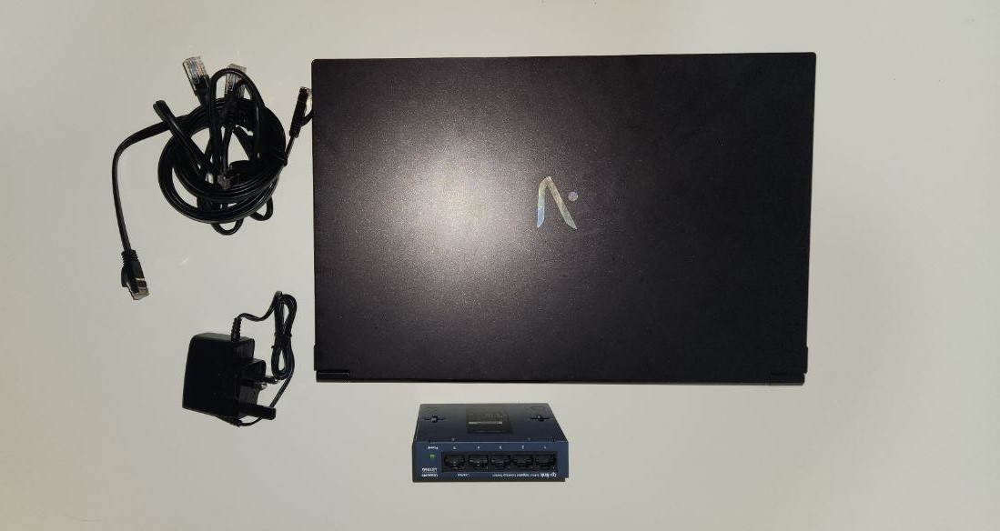

# Home Lab Project

## Table of Contents

- [Introduction](#introduction)
- [Hardware](#hardware)
- [Network Topology](#network-topology)
- [Virtual Machines](#virtual-machines)

## Introduction

This project is a virtual home lab setup designed to explore and learn various aspects of networking and virtualisation. By creating a virtualised environment using Proxmox, this lab simulates a small-scale network, allowing for hands-on experience with IT infrastructure components.

## Hardware

The core of this home lab setup is built on a laptop that serves as the host machine, running Proxmox Virtual Environment (VE).

### Host Machine

- **Processor**: Intel i7 10th Gen
- **RAM**: 16GB
- **Storage**:
  - **500 GB SSD**: Dedicated to the Proxmox installation and virtual machine storage.
  - **1 TB HDD**: Used for additional storage, including backups and large datasets.
- **Network**: Gigabit Ethernet

### Additional Hardware

- **Router**: TP-Link Deco M4
- **Switch**: TP-Link Network Switch LS015G
- **Other**: Cat6 Cables

## Network Topology

#### Virtual Network

The Proxmox host is equipped with a network bridge configuration that allows it to interface with both the external and internal networks. Here's how the networks are separated:

- **vmbr0 (WAN Bridge)**: This bridge connects the Proxmox host to the OPNsense WAN interface. It is assigned an IP address in the home network's subnet (`192.168.68.109`), which is directly reachable from the home router. This setup allows Proxmox to interact with the broader home network and the virtual network through OPNsense.

- **vmbr1 (LAN Bridge)**: This bridge connects the OPNsense LAN interface to the VMs. It is part of a separate internal subnet (`10.10.10.0/24`). This internal network is isolated from the home network, providing a secure environment for the VMs to communicate with each other while remaining protected from direct external access.

#### Home Network

The home network, managed by the home router, operates on a different subnet (`192.168.68.0/24`). This network provides connectivity for various devices, including:

- **Desktop PC**: Connected to the home router, which assigns it an IP address within the home network subnet. This device communicates with both the Proxmox host and other devices in the home network.

- **OPNsense Router**: Between the home network and the internal VM network, managing traffic and applying security rules. Its WAN interface is connected to `vmbr0`, allowing it to interact with the home network and the internet. Its LAN interface is connected to `vmbr1`, enabling communication with the VMs.

## Virtual Machines

- [**VM1: OPNsense**](./VMsetup/OPNsense-setup.md)

  - Role: Network and firewall management.
  - Details: Handles routing, firewall rules, and DHCP configurations.

- [**VM2: Ubuntu Docker**](./VMsetup/Ubuntu-Setup.md)

  - Role: Hosts Docker containers for various services.
  - Details: Runs Docker and manages containerized applications.

- [**VM3: TrueNAS**](./VMsetup/TrueNAS-setup.md)

  - Role: Network-attached storage.
  - Details: Provides file sharing and backup solutions.

- [**VM4: Windows Server 2022**](./VMsetup/Win2022-Setup.md)
  - Role: Active Directory management.
  - Details: Manages user accounts, network resources, and domain services.

## Future Improvements

Potential areas for future enhancements:

### Physical Implementation

- **Dedicated Hardware:** Transitioning from virtualized infrastructure to physical servers. Implementing physical routers, switches, and storage devices could better simulate environments.
- **Network Segmentation:** Introducing additional VLANs or separate physical networks for different services and VMs to improve security and traffic management.

### Cloud Migration

- **Hybrid Cloud Setup:** Integrate cloud services like AWS, Azure, or Google Cloud with the existing home lab to create a hybrid cloud environment.

### Other Potential Improvements

- **Monitoring & Analytics:** Implement comprehensive monitoring solutions like Prometheus and Grafana for real-time performance metrics, alerting, and historical data analysis.
- **Enhanced Security:** Set up advanced firewall rules, intrusion detection systems (IDS), and VPNs to further secure the network.
